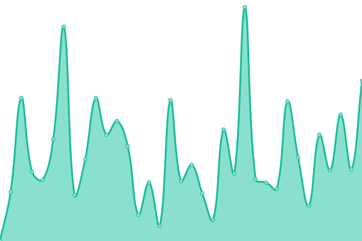
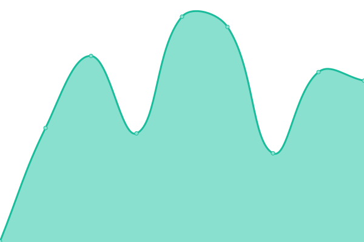

# [📈 Live Status](https://arisstadev.github.io/upptime): <!--live status--> **🟩 All systems operational**

This repository contains the open-source uptime monitor and status page for [arisstadev](https://arisstadev.github.io/upptime), powered by [Upptime](https://github.com/upptime/upptime).

With [Upptime](https://upptime.js.org), you can get your own unlimited and free uptime monitor and status page, powered entirely by a GitHub repository. We use [Issues](https://github.com/arisstadev/upptime/issues) as incident reports, [Actions](https://github.com/arisstadev/upptime/actions) as uptime monitors, and [Pages](https://arisstadev.github.io/upptime) for the status page.

<!--start: status pages-->
<!-- This summary is generated by Upptime (https://github.com/upptime/upptime) -->
<!-- Do not edit this manually, your changes will be overwritten -->
<!-- prettier-ignore -->
| URL | Status | History | Response Time | Uptime |
| --- | ------ | ------- | ------------- | ------ |
|  [AJTM Frontend](https://ajtm.com.mx) | 🟩 Up | [ajtm-frontend.yml](https://github.com/arisstadev/upptime/commits/HEAD/history/ajtm-frontend.yml) | 

 286ms
     
 | 

<a href="https://arisstadev.github.io/upptime/history/ajtm-frontend">100.00%</a>
    

|  [Arissta](https://arissta.com) | 🟩 Up | [arissta.yml](https://github.com/arisstadev/upptime/commits/HEAD/history/arissta.yml) | 

 327ms
     
 | 

<a href="https://arisstadev.github.io/upptime/history/arissta">100.00%</a>
    

|  [MLM Minerales](https://mimeminerales.com) | 🟩 Up | [mlm-minerales.yml](https://github.com/arisstadev/upptime/commits/HEAD/history/mlm-minerales.yml) | 

 602ms
     
 | 

<a href="https://arisstadev.github.io/upptime/history/mlm-minerales">100.00%</a>
    

|  [Team CLD](https://teamcld.com) | 🟩 Up | [team-cld.yml](https://github.com/arisstadev/upptime/commits/HEAD/history/team-cld.yml) | 

 756ms
     
 | 

<a href="https://arisstadev.github.io/upptime/history/team-cld">100.00%</a>
    

|  [Thermo Ingeniería](https://thermoingenieriayequipos.com) | 🟩 Up | [thermo-ingenieria.yml](https://github.com/arisstadev/upptime/commits/HEAD/history/thermo-ingenieria.yml) | 

 300ms
     
 | 

<a href="https://arisstadev.github.io/upptime/history/thermo-ingenieria">100.00%</a>
    

|  [iloadingdock](https://iloadingdock.com) | 🟩 Up | [iloadingdock.yml](https://github.com/arisstadev/upptime/commits/HEAD/history/iloadingdock.yml) | 

 227ms
     
 | 

<a href="https://arisstadev.github.io/upptime/history/iloadingdock">100.00%</a>
    

<!--end: status pages-->

[**Visit our status website →**](https://arisstadev.github.io/upptime)

## 📄 License

- Powered by: [Upptime](https://github.com/upptime/upptime)
- Code: [MIT](./LICENSE) © [Anand Chowdhary](https://anandchowdhary.com), supported by [Pabio](https://pabio.com)
- Data in the `./history` directory: [Open Database License](https://opendatacommons.org/licenses/odbl/1-0/)
